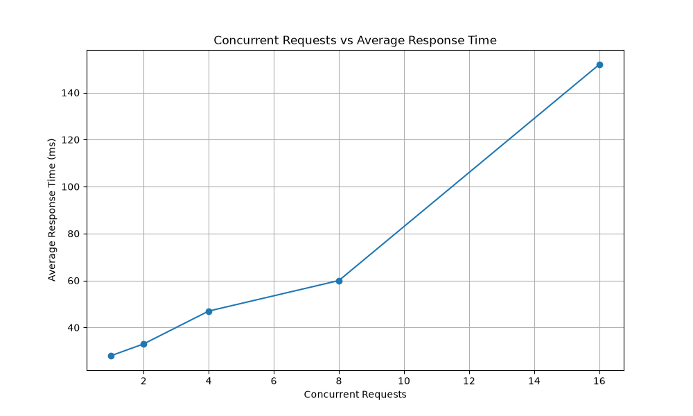
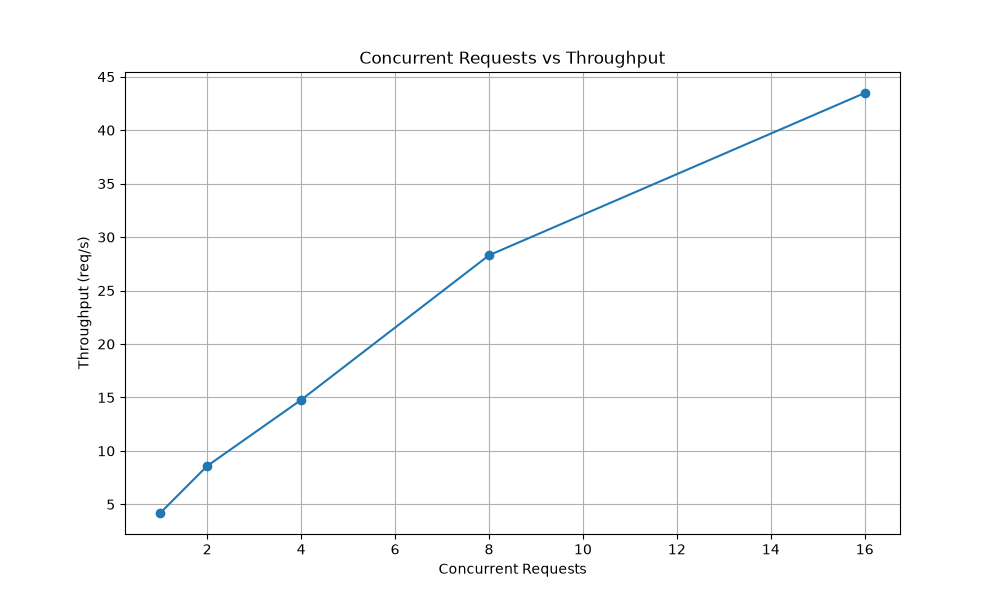
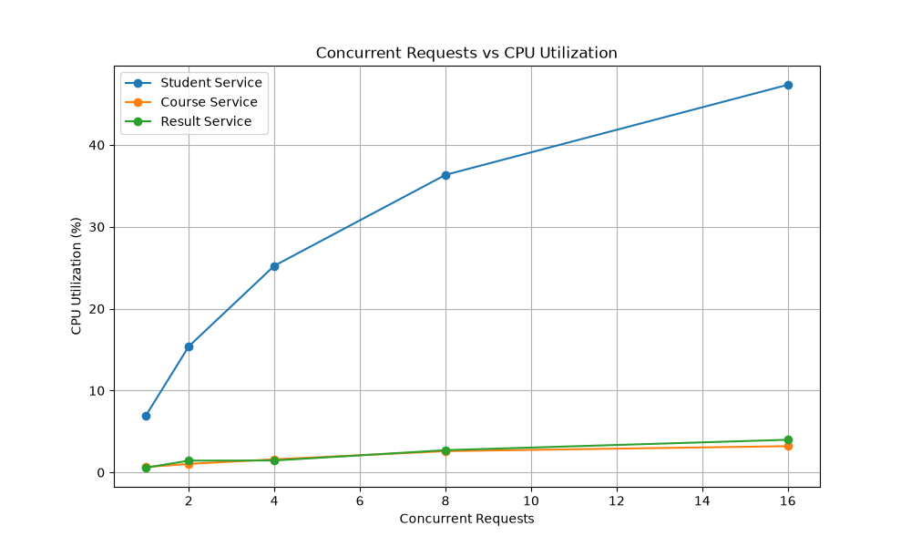
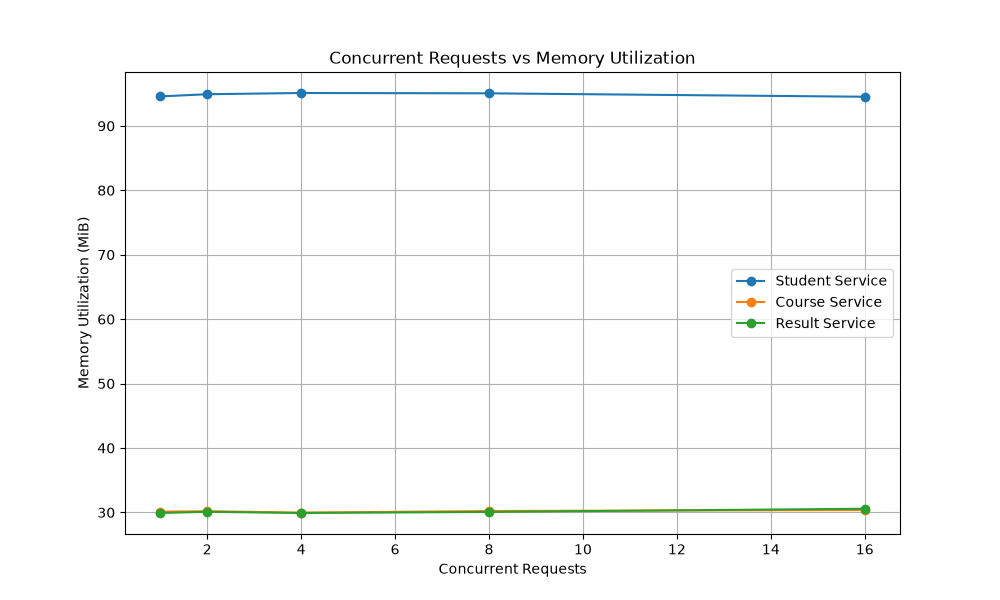
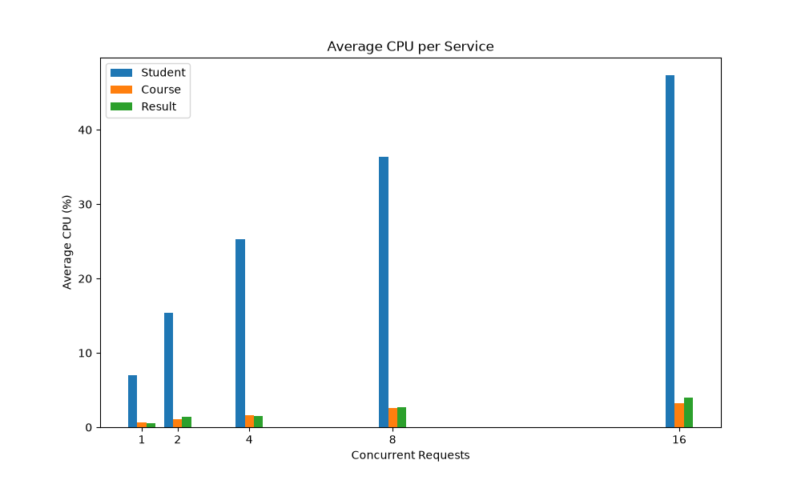
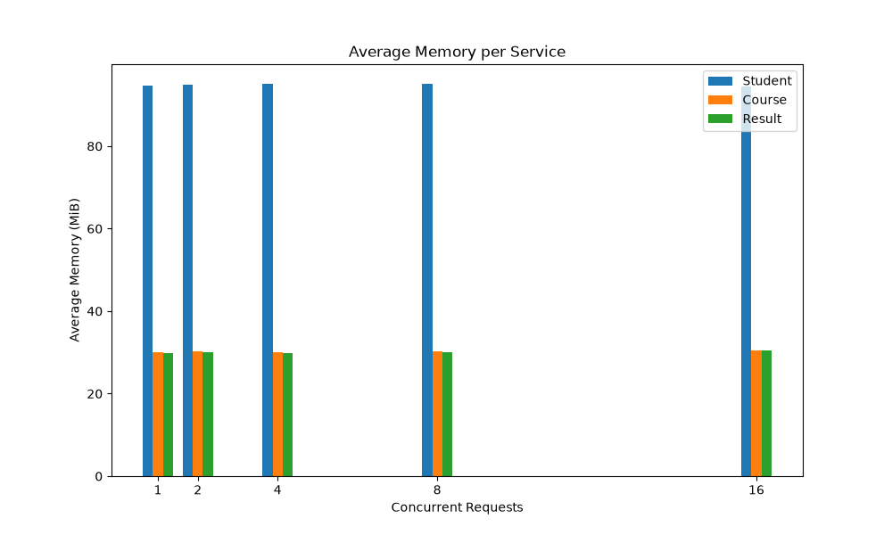

# Student Management Microservices

## 1. Project Overview
This project implements a Student Management System consisting of exactly three microservices. It was designed to fulfill the requirements of the experiment: "Build, Deploy and Analyze a Containerized Microservice Application Under Varying Workloads."

## 2. Architecture
The application architecture is based on three independent microservices developed in Python using FastAPI. A user request to the main dashboard triggers the Student Service, which in turn acts as an orchestrator and retrieves data asynchronously from the Course Service and Result Service before composing the final response.

## 3. Microservices

### Student Service
- **Port:** 5001
- **Responsibility:** Handles student information, overall orchestration, and acts as the entry point for end-to-end dashboard requests.
- **APIs:** 
  - `GET /`
  - `GET /students`
  - `GET /students/{student_id}`
  - `GET /students/{student_id}/dashboard`

### Course Service
- **Port:** 5002
- **Responsibility:** Maintains and provides course information linked to students.
- **APIs:**
  - `GET /`
  - `GET /courses`
  - `GET /courses/student/{student_id}`

### Result Service
- **Port:** 5003
- **Responsibility:** Maintains student results, marks, and grades, calculating averages dynamically.
- **APIs:**
  - `GET /`
  - `GET /results/{student_id}`

## 4. Docker Architecture
All three services are fully containerized using individual `Dockerfile` configurations and orchestrated simultaneously via `docker-compose.yml`. Each container exposes its respective port and can be scaled if necessary.

## 5. Docker Network
The system uses a custom Docker bridge network named `microservice-net`. All three services are attached to this network.

## 6. Inter-Service Communication
The services communicate with each other exclusively over the internal `microservice-net` Docker network using Docker service names, completely bypassing localhost. For example:
- `http://course-service:5002`
- `http://result-service:5003`

## 7. How to Run
```bash
docker compose build
docker compose up -d
docker compose ps
```

## 8. API Testing
Detailed API testing logs, actual requests, and responses are located in `docs/api_testing.md`. The end-to-end dashboard aggregates course and result records for a given student seamlessly.

## 9. Workload Testing
The API endpoint `/students/101/dashboard` was heavily load-tested using Locust. Performance measurements and container resource utilization observations (via `docker stats`) were logged simultaneously.

## 10. Workload Levels
- **W1** = 1 concurrent user
- **W2** = 2 concurrent users
- **W3** = 4 concurrent users
- **W4** = 8 concurrent users
- **W5** = 16 concurrent users

## 11. Performance Results
Detailed performance metrics (Throughput, Response Time, etc.) are available in `results/performance_results.csv` and `results/final_observation_table.csv`.

## 12. CPU and Memory Results
Resource monitoring data recording the average and peak CPU and Memory of all three services across all workloads is documented in `results/resource_observations.csv`.

## 13. Graphs
Visualizations including CPU usage, memory utilization, throughput, and response times relative to concurrent users are stored in `results/graphs/`.

### Concurrent Requests vs Average Response Time


### Concurrent Requests vs Throughput


### Concurrent Requests vs CPU Utilization


### Concurrent Requests vs Memory Utilization


### Average CPU per Service


### Average Memory per Service


## 14. Analysis
An in-depth analysis answering key experimental questions about bottlenecks, resource utilization, and overall system limits is documented in `results/analysis.md`.

## 15. Conclusion
The microservices ecosystem functioned correctly without any failed requests. The `student-service` acts as the primary bottleneck during scaling as it handles E2E orchestration and consumes the most CPU. Memory usage remained extremely stable across all services regardless of workload size. The architecture successfully fulfills all experimental objectives.

## 16. Checkpoint Status
Detailed evidence for the completion of all 5 lab checkpoints can be reviewed in `docs/CHECKPOINT_STATUS.md`.
